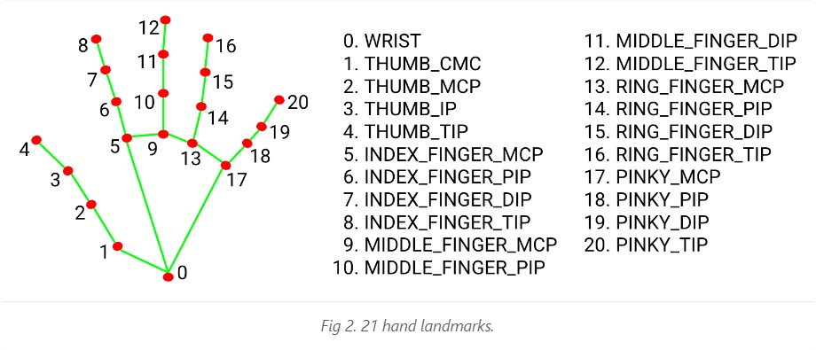
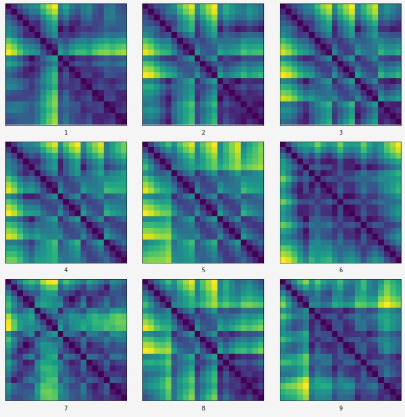
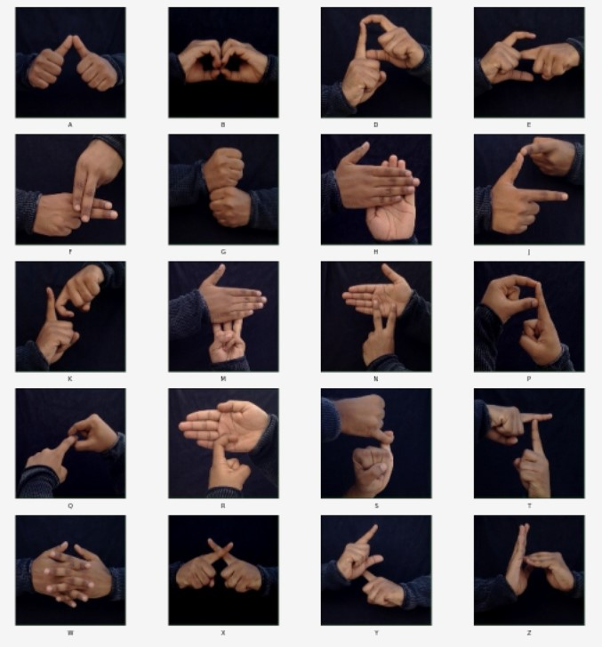

<!-- PROJECT LOGO -->
 

  

  <h3 align="center">Finger Spell</h3>

  

    A computer vision based sign language interpreter
     
    <a href="https://github.com/Anant-mishra1729/Finger-spell/"><strong>Explore the docs »</strong></a>
     
  

# Finger Spell

Finger Spell is an sign-language interpreter based on Computer vision and Machine learning.

It is made for those physically challenged people who know sign language but find it difficult to communicate with others through it.

# Description

## Sign languages
Visual languages involved with use of hands, facial and body movements as a means of communication. 
There are many of them few are listed below :
* ASL (American Sign Language).
* ISL (Indian Sign Language).
* British Sign Language (BSL).

# Project Phases

## OpenCV and Mediapipe
 

> Training
* Execute OpenCV_based\Train_sign.py
* HandTracker class to facilitate hand tracking using Mediapipe.
* Hand coordinates are collected for points  0, 4, 5, 9, 13, 17, 8, 12, 16 and 20 .
* Eucledian distance between these points is calculated and collected in their pickle files.
> Testing 
* Execute OpenCV_based\Test_sign.py
* Absolute error between current gesture and stored gestures is calculated.
* Resulting gesture is gesture with minimum calculated error.

## ISL Digit Classification 
### OpenCV + MediaPipe + Random Forest Classifier 
 

Plotting (21 x 21) image of Eucledian differences between points 0, 4, 5, 9, 13, 17, 8, 12, 16 and 20, these plots can be easily differentiated.

> Training
* ISL_Digits_Classifier\Digits10.ipynb
* Eucledian differences are collected in 21x21 array.
* Dataset is trained with **Random Forest Classifier**.
* Acheived accuracy of **99.04%**
> Testing 
* Execute OpenCV_based\Test.py
* Different digits are clearly recognised.
* 
## ISL Alphabets classification 
### OpenCV + MediaPipe + Random Forest Classifier
 

Plotting (21 x 21) image of Eucledian differences between points 0, 4, 5, 9, 13, 17, 8, 12, 16 and 20, plots can be easily differentiated.

> Under work ...

### Built With
Below are the major frameworks/libraries used in this project. They can be extended further...

* [Python](https://www.python.org/)
* [Opencv](https://opencv.org/)
* [Mediapipe](https://google.github.io/mediapipe/)
* [Tensorflow](https://www.tensorflow.org/)
* [Sklearn](https://www.tensorflow.org/)
