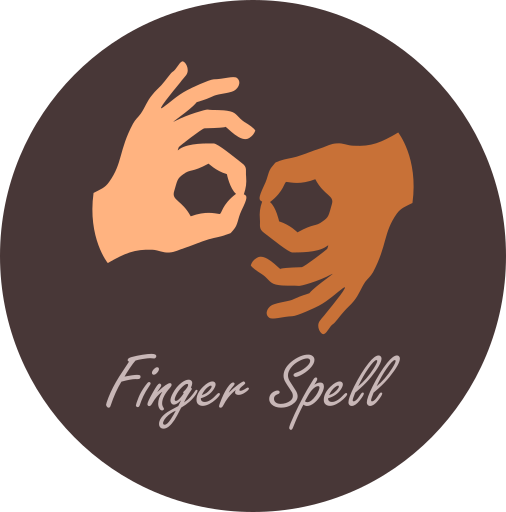

<!-- PROJECT LOGO -->
 

  

  <h3 align="center">Finger Spell</h3>

  

    A computer vision based sign language interpreter
     
    <a href="https://github.com/Anant-mishra1729/Finger-spell/"><strong>Explore the docs »</strong></a>
     
  

<!-- ABOUT THE PROJECT -->
## About The Project

<!-- [![Product Name Screen Shot][product-screenshot]](https://github.com/Anant-mishra1729/Finger-spell) -->

Sign languages are visual languages that use hand, facial and body movements as a means of communication. 
There are many of them few are listed below :
* ASL (American Sign Language).
* ISL (Indian Sign Language).
* British Sign Language (BSL).

### Here's why:

Finger spell is made for those physically challenged people who know sign language but find it difficult to communicate with others through it.

Of course, there are thousands of words in sign language and I can't add all of them, you may also suggest changes by forking this repo and creating a pull request or opening an issue. Thanks to all the people have contributed to expanding this project!

Use the `Contribution.md` to get started.

### Built With
Below are the major frameworks/libraries used in this project. They can be extended further...

* [Python](https://www.python.org/)
* [Opencv](https://opencv.org/)
* [Mediapipe](https://google.github.io/mediapipe/)
* [Tensorflow](https://www.tensorflow.org/)
